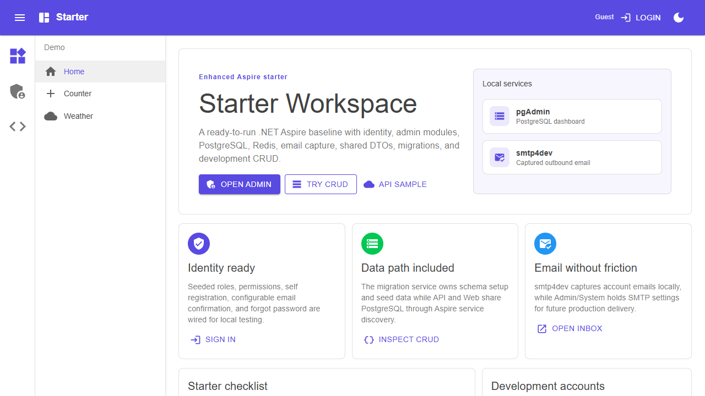
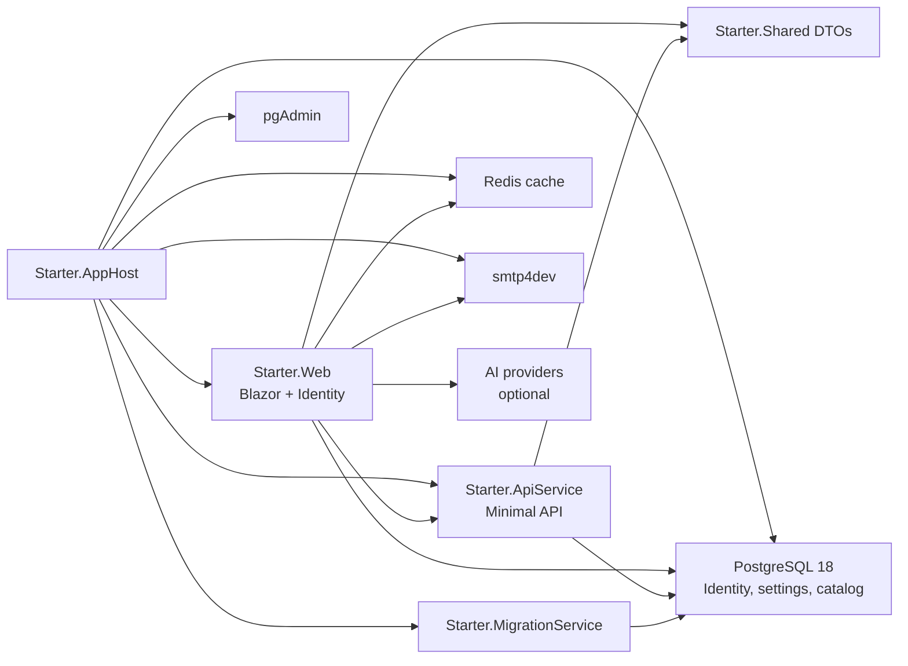

# Enhanced Aspire Starter

[](https://github.com/vwzhang/Starter/actions/workflows/ci.yml)


A polished .NET 10 Aspire admin starter for internal tools, admin portals, and full-stack business apps. It gives you the infrastructure most projects need on day one: authentication, role-based admin pages, runtime settings, PostgreSQL, Redis, local email capture, migrations, a Minimal API, a Blazor frontend, shared DTOs, and a real database-backed CRUD slice.



## Why Use This

Starting from a blank Aspire template is clean, but the first useful admin app usually needs the same foundation again and again. Enhanced Aspire Starter packages that foundation into a working application you can run, inspect, rename, and extend.

| What you need | Already included |
| --- | --- |
| Local orchestration | Aspire AppHost with PostgreSQL 18, Redis, pgAdmin, smtp4dev, API, Web, and migration service |
| Authentication | ASP.NET Core Identity, seeded test accounts, self registration, email confirmation, forgot/reset password |
| Authorization | Admin roles, permissions, feature flags, policy-protected admin pages |
| Admin UI | Dashboard, users, roles, permissions, features, and system configuration |
| Configuration | Runtime settings stored in the database, including SMTP and account-flow options |
| Data path | EF Core migrations, API-owned catalog schema, shared DTOs, Blazor CRUD UI |
| AI integration | Admin-configured AI chat client for ChatGPT, Gemini, GitHub Models, Groq, and Azure Foundry |
| Developer loop | Local email inbox, pgAdmin, Redis output cache, Aspire dashboard, smoke test |

## Five-Minute Start

Prerequisites:

- .NET 10 SDK
- Aspire CLI
- Docker Desktop or another Docker-compatible runtime

Clone and run the full stack:

```powershell
git clone https://github.com/vwzhang/Starter.git
cd Starter
aspire start --apphost Starter.AppHost/Starter.AppHost.csproj
```

Then open the `webfrontend` endpoint shown by Aspire. Dashboard, web, API, pgAdmin, and smtp4dev ports are assigned dynamically so multiple generated projects can run side by side.

Useful local URLs:

| Area | URL |
| --- | --- |
| Workspace dashboard | `webfrontend` endpoint + `/` |
| Admin login | `webfrontend` endpoint + `/admin/login` |
| Catalog CRUD sample | `webfrontend` endpoint + `/dev/catalog` |
| AI chat demo | `webfrontend` endpoint + `/ai-chat` |
| pgAdmin | `pgadmin` endpoint in Aspire Dashboard |
| smtp4dev inbox | `smtp4dev` endpoint in Aspire Dashboard |
| Aspire dashboard | Printed by `aspire start` |

If a port changes, ask Aspire:

```powershell
aspire describe --apphost Starter.AppHost/Starter.AppHost.csproj
```

## Create From The Template

The installable template is maintained in the companion repository:

```text
https://github.com/vwzhang/Starter.Template
```

After installing the template package, create a new app with:

```powershell
mkdir C:\Code\AcmeOps
cd C:\Code\AcmeOps
dotnet new enhanced-aspire-starter -n AcmeOps
dotnet build AcmeOps.slnx
aspire start --apphost AcmeOps.AppHost/AcmeOps.AppHost.csproj
```

The project folders are created directly in the current directory, so `AcmeOps.AppHost`, `AcmeOps.Web`, `AcmeOps.ApiService`, and the solution file all sit at the solution root.

The template has practical switches so each project can start with the right local shape:

```powershell
dotnet new enhanced-aspire-starter `
  -n AcmeOps `
  --database-name acmeopsdb `
  --include-pgadmin true `
  --include-smtp4dev true `
  --seed-users true `
  --seed-sample-data true
```

| Option | Default | Use when |
| --- | --- | --- |
| `--database-name` | `<project-name>db` | You want a specific database and connection-string name |
| `--include-pgadmin` | `true` | You want a browser UI for inspecting PostgreSQL locally |
| `--include-smtp4dev` | `true` | You want account emails captured without an external SMTP server |
| `--seed-users` | `true` | You want ready-to-use admin, manager, and user accounts |
| `--seed-sample-data` | `true` | You want the Catalog CRUD page to open with sample data |

## Default Accounts

The migration service seeds local users in Development when `--seed-users` is enabled:

| Email | Role | Password |
| --- | --- | --- |
| `admin@starter.local` | Administrator | `Happy1..` |
| `manager@starter.local` | Manager | `Happy1..` |
| `user@starter.local` | User | `Happy1..` |

Open `/admin/login` or use the login button in the app bar.

## Architecture



The application is intentionally split the way a real Aspire app usually grows:

| Project | Responsibility |
| --- | --- |
| `Starter.AppHost` | Aspire orchestration and local resources |
| `Starter.ApiService` | Minimal API backend and API-owned catalog data |
| `Starter.Web` | Blazor Web App, Identity, admin module, settings, dev pages |
| `Starter.Shared` | DTOs shared by API and Web |
| `Starter.MigrationService` | EF Core migrations and seed data |
| `Starter.ServiceDefaults` | Health checks, telemetry, service discovery, resilience |
| `Starter.Tests` | Aspire integration smoke test |

## Admin And Settings

The Admin module is meant to be useful immediately and easy to replace later.

Included tabs:

- Dashboard
- Users
- Roles
- Permissions
- Features
- System settings

System settings are stored in the database and seeded by `Starter.Web/Services/SystemConfigurationService.cs`. They include:

- Current AI provider, provider endpoints, model names, and API keys
- Self registration
- Require email confirmation
- Display development confirmation/reset links
- Public base URL
- SMTP delivery, host, port, SSL, username, password/API key

Secret values are protected with ASP.NET Core Data Protection before they are stored.

## Local Email

The default AppHost runs smtp4dev, so account email flows work without an external SMTP server.

Development defaults:

- Email delivery enabled
- SMTP host and port supplied by the Aspire smtp4dev resource
- SMTP SSL disabled
- SMTP username/password blank
- From address `no-reply@starter.local`

Open the `smtp4dev` endpoint from the Aspire Dashboard to inspect captured messages. Forgot password and email confirmation are both wired through the same account email sender.

## Catalog CRUD Slice

The Catalog module demonstrates the recommended shape for a real feature: API owns the data model, Web owns the UI, and Shared owns the DTO contract.

| Layer | Files |
| --- | --- |
| DTOs | `Starter.Shared/CatalogDtos.cs` |
| Entities | `Starter.ApiService/Data/CatalogCategory.cs`, `Starter.ApiService/Data/CatalogProduct.cs` |
| EF Core | `Starter.ApiService/Data/CatalogDbContext.cs`, `Starter.ApiService/Data/Migrations/*_CatalogCrud.cs` |
| Seed data | `Starter.ApiService/Data/CatalogSeedExtensions.cs` |
| API | `Starter.ApiService/CatalogEndpoints.cs` |
| Web client | `Starter.Web/CatalogApiClient.cs` |
| Blazor page | `Starter.Web/Components/Pages/Dev/Crud.razor` |
| Navigation | `Starter.Web/Components/Pages/Dev/DevNav.razor` |

API endpoints:

```text
GET    /dev/catalog/categories
POST   /dev/catalog/categories
PUT    /dev/catalog/categories/{id}
DELETE /dev/catalog/categories/{id}

GET    /dev/catalog/products
POST   /dev/catalog/products
PUT    /dev/catalog/products/{id}
DELETE /dev/catalog/products/{id}
```

Use this slice as the copy-and-rename pattern for the first real module in your app.

## AI Chat

The Demo module includes an optional `/ai-chat` page that uses the current AI API client selected in Admin settings. Open `/admin/ai` to configure:

- `ai.current_provider`: `openai`, `deepseek`, `gemini`, `github`, `groq`, or `azure-foundry`
- `<provider>.endpoint`: OpenAI-compatible Chat Completions endpoint
- `<provider>.model`: model name for that provider
- `<provider>.api_key`: secret API key or token
- `ai.system_prompt`: system prompt sent with each chat request

The default endpoints are seeded for ChatGPT, DeepSeek, Gemini, GitHub Models, and Groq. Azure Foundry accepts your Azure OpenAI/Foundry chat completions or responses endpoint and uses the `api-key` header. The app still starts without API keys or model names; `/ai-chat` shows configuration status and disables sending until the selected provider has endpoint, model, and API key configured.

For local development, keep the OpenAI key out of the database and source tree by using .NET User Secrets. The `Starter.Web` project reads `AI:OpenAI:ApiKey`, which overrides the value configured in Admin settings:

```powershell
dotnet user-secrets set "AI:OpenAI:ApiKey" "your-api-key" --project Starter.Web
```

The same pattern is available for the built-in providers: `AI:DeepSeek:ApiKey`, `AI:Gemini:ApiKey`, `AI:GitHub:ApiKey`, `AI:Groq:ApiKey`, and `AI:AzureFoundry:ApiKey`.

## Common Commands

Build:

```powershell
dotnet build Starter.slnx
```

Run tests:

```powershell
dotnet test Starter.slnx
```

Start Aspire:

```powershell
aspire start --apphost Starter.AppHost/Starter.AppHost.csproj
```

Stop Aspire:

```powershell
aspire stop --apphost Starter.AppHost/Starter.AppHost.csproj
```

Rebuild one running resource:

```powershell
aspire resource webfrontend rebuild --apphost Starter.AppHost/Starter.AppHost.csproj --non-interactive
```

Add an Identity/Admin migration:

```powershell
dotnet ef migrations add MigrationName --project Starter.Web/Starter.Web.csproj --startup-project Starter.Web/Starter.Web.csproj --context ApplicationDbContext --output-dir Data/Migrations
```

Add a Catalog/API migration:

```powershell
dotnet ef migrations add MigrationName --project Starter.ApiService/Starter.ApiService.csproj --startup-project Starter.ApiService/Starter.ApiService.csproj --context CatalogDbContext --output-dir Data/Migrations
```

## Development And Production Defaults

Development is intentionally convenient:

- Self registration enabled
- Email delivery enabled through smtp4dev
- Password reset links can be displayed on screen
- Email confirmation links can be displayed on screen when confirmation is enabled
- Seeded users available with a simple shared password

Production defaults are more conservative:

- Self registration disabled
- Email delivery disabled until configured
- Development confirmation/reset links disabled

Before production, set real SMTP settings, change seed credentials, choose your registration policy, configure persistent hosting storage, and review role/permission names for your domain.

## Current Template Roadmap

The next useful template options are database provider choices, such as PostgreSQL, SQL Server Express, LocalDB, and SQLite. The current version is PostgreSQL-first because it gives the cleanest Aspire local-development story.

## Search Keywords

`dotnet aspire starter`, `aspire template`, `blazor admin starter`, `aspnet core identity`, `mudblazor dashboard`, `postgresql aspire`, `minimal api starter`, `smtp4dev`, `ef core migrations`, `redis output cache`.

## License

MIT
